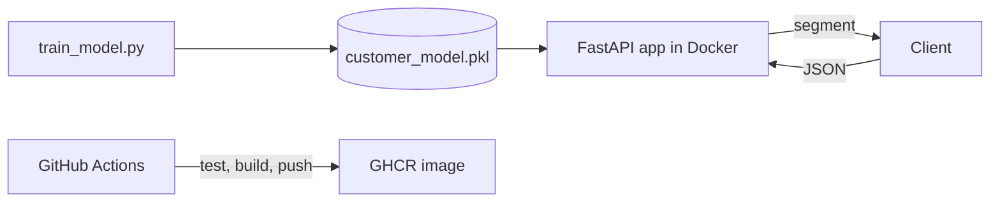

# Customer Segmentation API

A small ML API that sorts a customer into one of four segments from five numbers: age, annual income, spending score, purchase frequency and average order value.

**Live:** https://cc-graded-assessment.onrender.com — the page at `/` calls the API directly. [API docs](https://cc-graded-assessment.onrender.com/docs)

## Overview

Training and serving are two phases that never run at the same time.

**Training (offline, once).** `train_model.py` generates 1,000 synthetic customers and clusters them into four segments with KMeans.

**Serving (per request).** A FastAPI service loads the artifact at startup and assigns each customer to a segment over HTTP.

The trained model is one committed file (`model/customer_model.pkl`, 2,349 bytes) holding the fitted scaler, the fitted KMeans, feature names and order, segment metadata, metrics and version provenance. It is baked into the Docker image, so a container is self-contained — no database, no external model store, no network calls at inference time.

**Problem it solves:** a `.pkl` file on a laptop cannot be called by anything. Serving it as an API means callers need no scikit-learn, input is validated before it reaches the model, the environment is reproducible, and the deployed image is provably the one that passed the tests.

## Project structure

```
app/
  main.py          # routes and startup
  static/
    index.html     # interactive page shown at / and /ui
  model.py         # loads the model and predicts
  schemas.py       # request/response validation
model/
  customer_model.pkl
tests/
  test_api.py
train_model.py     # trains and saves the model
Dockerfile
requirements.txt
.github/workflows/ci-cd.yml
```


## Tech stack

- Python 3.11, scikit-learn (StandardScaler + KMeans, k = 4)
- FastAPI + Pydantic, served with uvicorn
- Docker
- Pytest
- GitHub Actions, GitHub Container Registry (GHCR)
- Render

<!-- ## Architecture



The model is trained once on 1,000 synthetic customers and saved to `model/customer_model.pkl`. The API loads it at startup. -->

## Run locally

```bash
python -m venv .venv
source .venv/bin/activate        # Windows: .venv\Scripts\activate
pip install -r requirements.txt
uvicorn app.main:app --reload --port 8000
```

Open http://localhost:8000/ for the interactive page, or http://localhost:8000/docs for the API docs.

## Docker

```bash
docker build -t customer-segmentation-api .
docker run -d --name seg-api -p 8000:8000 customer-segmentation-api
curl http://localhost:8000/health
```

## API

| Method | Path | What it does |
| --- | --- | --- |
| GET | `/` | Project page in a browser, JSON index for API clients |
| GET | `/ui` | The same page, always HTML |
| GET | `/health` | Health check |
| POST | `/predict` | Segment one customer |
| POST | `/predict/batch` | Segment 1–100 customers |
| GET | `/segments` | List the four segments |
| GET | `/model/info` | Model details and training metrics |

Example:

```bash
curl -X POST http://localhost:8000/predict \
  -H "Content-Type: application/json" \
  -d '{"age":40,"annual_income_k":61.0,"spending_score":51,"purchase_frequency":13,"avg_order_value":74.0}'
```

Response:

```json
{
  "segment_id": 2,
  "segment_name": "Mainstream Families",
  "segment_description": "Middle income, moderate engagement. The core mass-market cohort.",
  "distance_to_centroid": 0.0623,
  "confidence_margin": 0.9731,
  "segment_distances": {
    "Affluent Conservatives": 2.947,
    "Premium Loyalists": 2.3973,
    "Mainstream Families": 0.0623,
    "Young Digital Spenders": 2.3137
  }
}
```

Invalid input (out-of-range values, missing or unknown fields) returns `422`.

## CI/CD

The workflow in `.github/workflows/ci-cd.yml` runs on every push and pull request to `main`:

1. **Test:** install dependencies, check the model file, run Pytest.
2. **Build:** build the Docker image, start it, and smoke-test `/health` and `/predict`.
3. **Publish:** on pushes to `main`, push the image to GHCR.

Image: `ghcr.io/kritee0301/customer-segmentation-api`

## Deployment

Deployed on Render: https://cc-graded-assessment.onrender.com

## Tests

```bash
python -m pytest -v
```

52 tests, all passing. They cover the endpoints, input validation, batch predictions, and model loading errors.

## What Is Simulated?

Only the **dataset**: 1,000 customers generated from four statistical archetypes with a fixed seed, clipped and rounded to look plausible, with segment names describing those groups. No real customer data or personal information is involved.

Everything else is real — training, the model, the API, validation, the container, health checks, the CI/CD pipeline and the cloud deployment.
